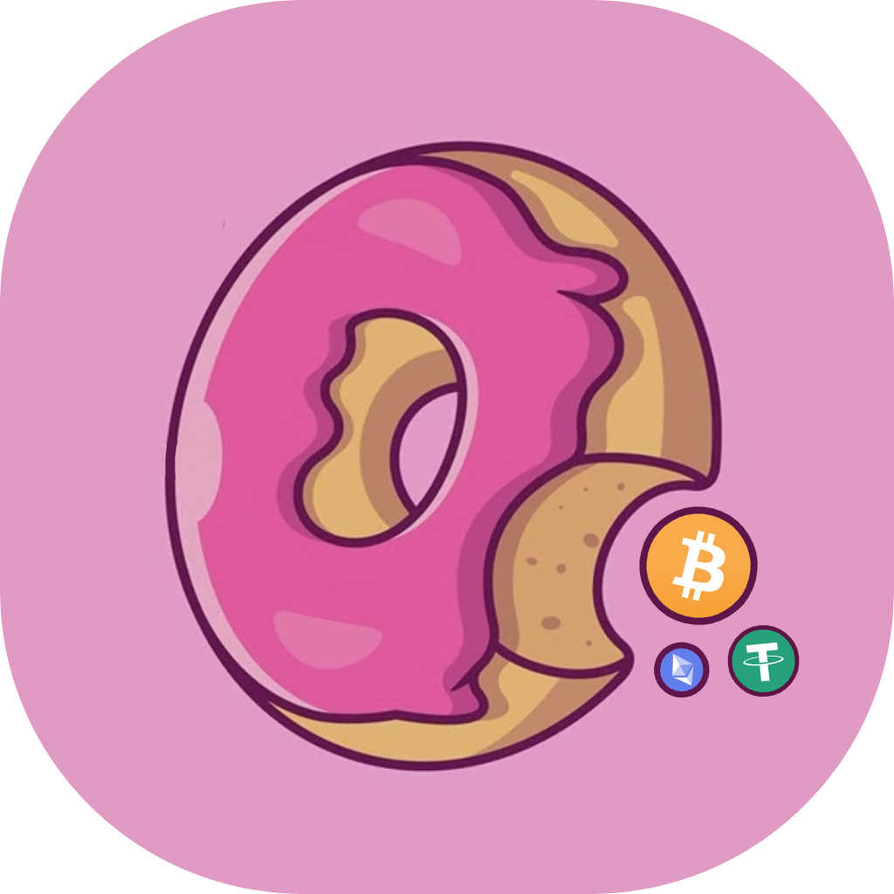
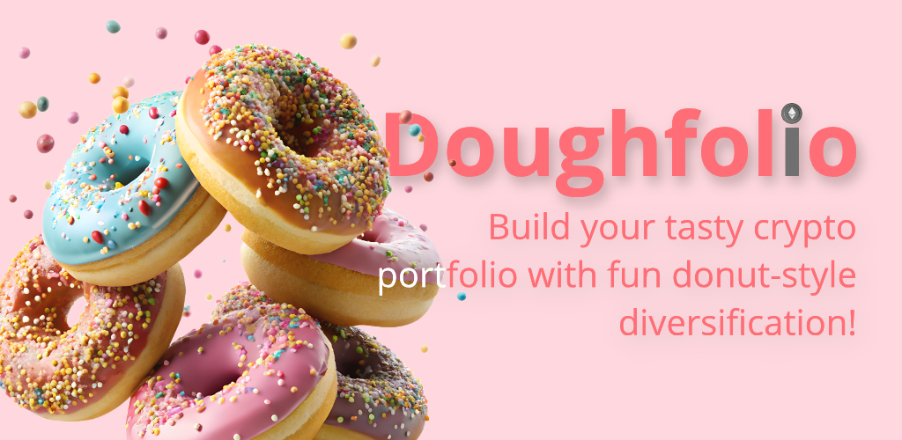
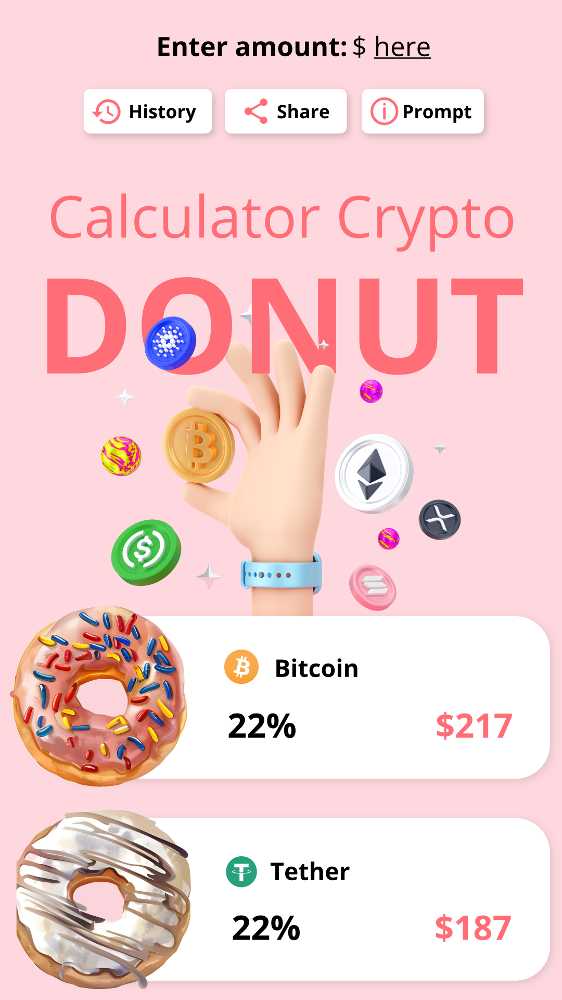
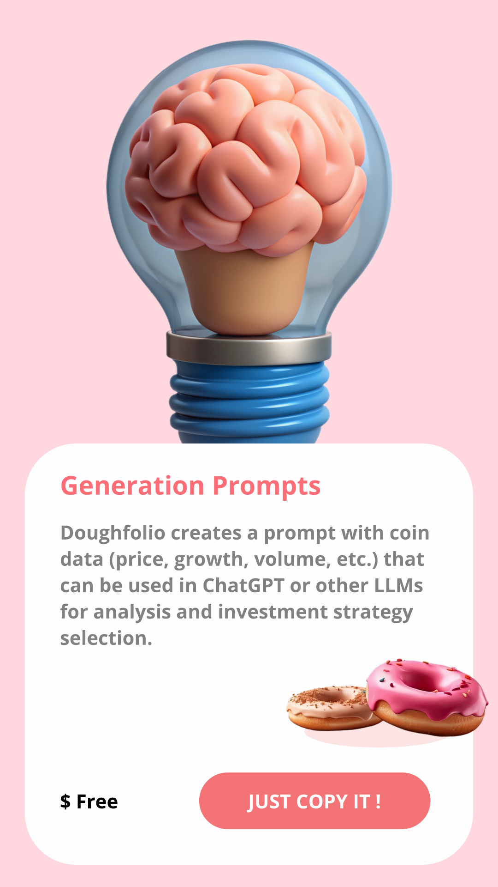

 

  

  <h3 align="center">Doughfolio</h3>

  

    <a href="https://github.com/wladradchenko/wunjo.wladradchenko.ru/issues">Issue</a>
    ·
    <a href="https://github.com/wladradchenko/wunjo.wladradchenko.ru/discussions">Discussions</a>
    ·
    <a href="https://play.google.com/store/apps/details?id=com.wladradchenko.donut&pli=1)](https://play.google.com/store/apps/details?id=com.wladradchenko.donut&pli=1">Google Play</a>
  

## Description

Looking for a fun and easy way to diversify your crypto investments? **Doughfolio** makes it easy — and delicious! Simply enter your total budget, and with just one tap, Doughfolio will automatically create a randomized portfolio of 10 cryptocurrencies, divided into well-balanced allocations. Each coin is visualized as a colorful donut for a fun (and tasty!) experience.

### 🧁 Features

- 🎯 **Automatically create diversified crypto portfolios** based on your total budget.
- 🍩 **Donut-style visual interface** to make finances fun and easy to understand.
- 🕘 **View your portfolio history** for previous generations.
- 🔗 **Share your results** with friends or on social media.
- 🤖 **AI prompt generator** for deeper exploration of your coins with LLMs (Large Language Models).
- 📊 **For both beginners and crypto enthusiasts** — suitable for new investors and experienced traders alike.

## 📸 Screenshots

  
  
  

## 🚀 How to Get Started

1. Download **Doughfolio** from [Google Play](https://play.google.com/store/apps/details?id=com.wladradchenko.donut&pli=1).
2. Enter your total budget and tap to generate your portfolio.
3. Enjoy the visualization of your portfolio in donut form!
4. Open rare coins with a single tap and explore them using AI prompts.
5. Share your results with friends and keep track of your portfolio history.

## ⚙️ Installation

**Doughfolio** is available for download on **Android** via Google Play. Simply go to [this link](https://play.google.com/store/apps/details?id=com.wladradchenko.donut&pli=1) and install the app.

For development:

1. Install **Node.js** (version 14 or higher) from [here](https://nodejs.org/).
2. Clone the repository `git clone https://github.com/your-username/doughfolio.git`.
3. Install dependencies `npm install`.
4. Run the project on Android (with Expo) `npm run android` and IOS `npm run ios`.

## 🔨 Build

Once you've made changes and are ready to build your app for production, you can use Expo Application Services (EAS) to create a build for either Android or iOS. Make sure you have EAS CLI installed. If you don't have it installed, run `npm install -g eas-cli`.

### 🤖 Build for Android

To build the app for Android, run the following command `npx eas build -p android`.

### 🍏 Build for iOS:

To build the app for iOS, run the following command `npx eas build -p ios`

> After running the build command, you can follow the prompts to log in with your Expo account, configure the build, and upload it to the relevant store (Google Play or App Store).

## 📑 License

This project is licensed under the [MIT License](LICENSE).

## 👾 Feedback

If you have suggestions or questions, feel free to contact us at [i@wladradchenko.ru](mailto:i@wladradchenko.ru). We’re always happy to hear from you!

## 💬 Support

**Doughfolio** is always looking for new ideas and improvements. Share your feedback or tell us how we can make your crypto journey even more fun!
